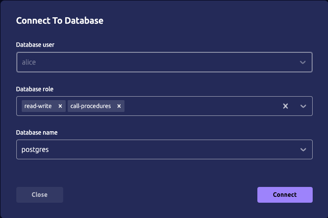

# RFD 0181 - PostgreSQL database access through Web UI

## Required Approvals

TODO

## What

TODO

## Why

TODO

## Details

### UX

#### User story: Alice access database using Teleport for the first time.

Alice is new to Teleport, but she's experienced with PostgreSQL and has spent
a considerable time using `psql`, the PostgreSQL CLI.

Before her access, a system administrator had already enrolled a PostgreSQL
instance and created a set of users the Teleport users could use. Those
database users and the existent databases of the instance are listed on the
role assigned to Alice.

She first logs into Teleport's Web UI and then searches for the desired database
on the resources list. After locating it, she clicks on the "Connect" button.


After clicking, a modal window with connection information is presented. In that
window, she needs to select which database and database user she'll be using.
Teleport already fills this information based on her permissions, so she doesn't
need to find this information somewhere else or ask someone. Also, this will
prevent her from inputting the information incorrectly and being unable to
connect.


After selecting the required information, she's redirected to a new tab
containing an interactive shell, similar to `psql`, where she can type
her queries.


After interacting with the database, she closes the tab, and her database
session ends.

##### Auto-user provisioning enabled

This is the same scenario, but the PostgreSQL instance was configured with user
provisioning enabled. This change implies which information Alice sees on the
connect modal. She doesn’t need to select the database user, as it will default
to her username. The select is then disabled, and a new now select will be
presented where she can select database roles attached to their user.



#### PostgreSQL interactive terminal

##### Supported commands

In addition to executing queries, the interactive shell will implement some
backlash (\) commands from `psql`. Initially only like descriptive commands
(such as `\d`) will be supported.

##### Limitations/Unpported commands

Teleport PostgreSQL interactive shell will not be a complete feature pair with
`psql`. Those limitations will be due to security measures or the shell's
simplicity. Given those limitations, messages will be shown to the users,
displaying a description and direction on executing the desired command
(if applicable).

Unsupported backslash (\) commands from psql will only display a failure
message:

```shell
postgres=> \set a "hello"
Invalid command \set.
Try "help" or "\?" for the list of supported commands.

postgres=>
```

Other limitations, such as query size limit, will display a more complete message:

```shell
postgres=> INSERT INTO ... # Long query.
ERROR: Unable to execute query. Max query size limit (200 characters) exceeded.
For long queries, execute it using `tsh db` commands.

postgres=>
```

### Implementation

TODO


